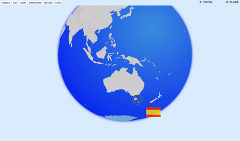
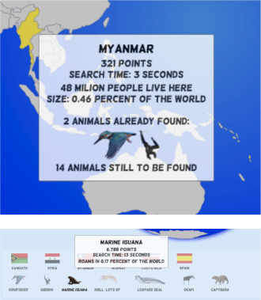
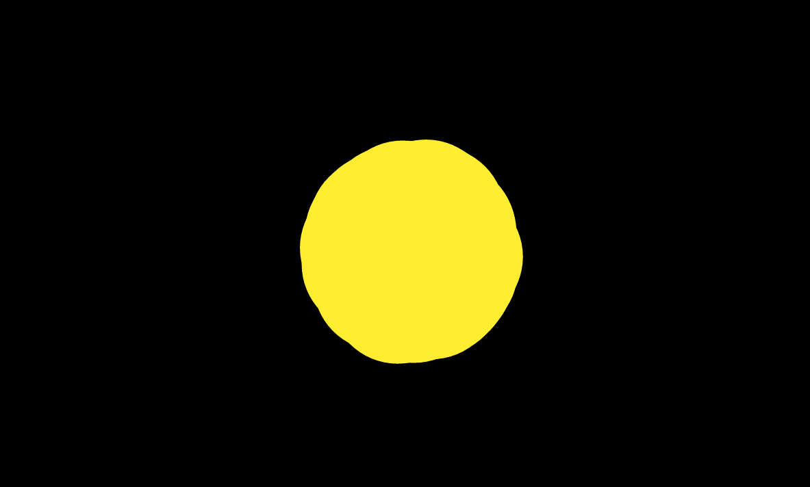

## Flanimals

###### A game of flags, animals and the world in shreds

---

1. [Rules] (#how-it-works)
2. [Stats] (#the-stats)
3. [Supernovas] (#the-supernova)
4. [Technicalities](the-techincal-stuff)

---

This is how flanimals started:


It's my son having breakfast in front of a 2x2 meter map finding the flag of Yemen. At the bottom of the map is a strip of flags for each country with an alphanumerical coordinate in the simple form of A1 (not many countries there) or similar. Initially attracted by the pleasing flags, he soon noticed the coordinate next to each flag and after brief decoding instructions stepped on the table to match country to flag.

As I like maps as well as my child I started building Flanimals. The rules are nearly as straightforward as the rules of the original breakfast-map-game. Look at the flag and try and find it on the map. Instead of the 2 finger finding system in a cartesian coordinate system, I went for a slightly different route to joy: a trail your flag leaves during the search, colour-coding how close you are to the country at question. The further away you are the more blue it is - the closer you get the more red your trail becomes.





This is bringing in a second game or rather sub-game we still do enjoy frequently: hot and cold. Playing question and answer games or seeking games (like I see something you don't see or hit the pot) we guide answer attempts by calling close shots hot and far-off tries cold. It turned out to be a rather good addition to Flanimals bypassing aggressive frustration from any originally unguided flag-search. The visible trail was in fact entireley unintended to start with and only brought to my attention by a bug in the code and immediately adopted by my son. Priceless accidental beauty.

Flags were fine so far but then he got another map:


Clearly we needed to add animals. So I sat down for a couple of weeks picking 111 animals worth becoming a Flanimal. Finding decent pictures, cutting them, sizing them, collecting sounds for them (damn you muted coati !), gauging their range areas - sometimes from lists, often from range maps (no scientific ground truth claimed) and eventually writing a little app generating arrays of countries each animal roams in based on the eclectic pond of sources I compiled. 

--

#### How it works

Choose between a globe (orthographic) or a flat (robinson) projection, between flags or animals, between German or English. You can change back and forth during the game at any point. Whatever you choose, you might want to **turn on the sound* to hear a gratifying bing-noise when you found yor flag or the (often original) animal grunts upon findind a country the animal at question roams. Your found flags and animals will be presented trophy-like below the world, allowing you to always revert to them to bask in your success. Hovering over the animals will give you some extra information and clicking on them will show their range area. Clicking on the flags will show you that country on the map or globe and hovering over the found countries on the map will tell you about that country and your phenomenal achievments, like how long it took you to find it, how many animals you found living there and not last how many points you got.



--

#### The stats

Speaking of which, you get points for each country and animal you found. I worked out an unnecessarily complex algorithm to calculate the points per thingy depending on the size of the country or range area, the time it took you to find it and a few other things I forgot. But it's really fair.

Apart from the lower panel of fame, showing your collection of flanimals, you can revel in your stats in summary by clicking on the *stats* (*zahlen*) button. You can see how much points you got for which flanimal, how long it took you and more...


--

#### The supernova

For a long time I thought about what happens when you're done. Surely, money was a big favourite. But then my son suggested to let the world explode. That made immediate sense to me. So I set out to code a supernova. Funfunfun. It was actually so much fun, that I didn't want to tie it exclusively to the very end of the game. Not least as few people have actually made it through 111 animals and 178 flags. I can't blame them and that's why there needs to be a sign in for people to pick it up again. I agree. 

So now you can sit back and watch the final spin by just clicking on the conveniently accessible  button. Do it. No loss. It's only a game (and you can enjoy resurrection if you wait for the last shred).



--

#### The technical stuff

Apart from really enjoing working together with a five year old on this, a big incentive was making maps and globes move with D3. The game was coded purely in Javascript relying heavily on the awesome [D3.js](https://d3js.org/). No jQuery (there's D3 ?!), yet a dash of [lodash](https://lodash.com/) helped with some data manipulation. One of the more tricky bits was making the world not only spin during the supernova but move on an eliptical path before being shredded by the powers of the universe. I previously would have used SMIL-animations without much qualms, but my bad conscience grows as it really peters out into extinction, making space for CSS animations. While really supporting focus on as few canonical, yet powerful tools as possible, I think I'll miss SMIL. I made it sort of work in CSS animations, yet SMIL allowed me more control over the eliptical path which - maybe for the last time - made me go for [SMIL](https://en.wikipedia.org/wiki/Synchronized_Multimedia_Integration_Language).

Most of the style is pure CSS, but I used the tasty [textures.js](https://riccardoscalco.github.io/textures/) for the range-areas. Ideally I would've used a bit of [Sebastian Meier's d3.sketchy](https://github.com/sebastian-meier/d3.sketchy) which also looks yummy, but keeping an eye on a lean DOM and process I eventually sticked to simple CSS paints.

What else? The overall javascript structure is modular with a single g-object keeping data and state for the sake of an unsoiled namespace. Here's the topline module split:

```JavaScript

// utility functions

function dataprep(err, data) {
	// mangling the data
}

vis.map = (function(){ 
	// the map
})(); 

vis.elements = (function(){
	// the left panel choosing flags and animals
})(); 

vis.collection = (function(){
	// the bottom panel collecting found flags and animals
})(); 

vis.points = (function(){
	// the point logic and top panel
})(); 

vis.stats = (function(){
	// the visualization of the statistics
})(); 

```

By now I would probably put even more thought into modularity, but the applied levels already allow for a decent seperation of elements and access into debugging and refactoring orgies - even after reverting to it a year later. Still some big functions in there which by now I would probably split up and abstract quite a bit more, but again. Its not spaghetti. If you disagree or want to know more, get in touch !

...and have a play.

