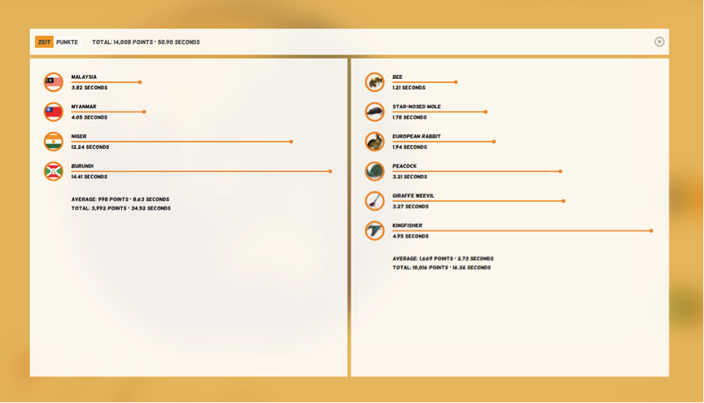

## Game stats

Here's a small stat-interface from *Flanimals*, a [flag- and animal-finding game](http://larsvers.github.io/flanimals/)... 



It encodes all stats as sorted lollipop charts per section. We can change the sorting direction and the sorting base - as in either Time or Points. Apart from the usual D3-patterns there are 2 (noteworthy?) features implemented. The modal blurs the background with a CSS filter like so:

```JavaScript
d3.select('div#container')
	.style('-webkit-filter', 'blur(20px)')
	.style('filter', 'blur(20px)');
```

and the images in the icons are produced as SVG patterns:

```JavaScript

var defs = svg.append('defs'); // define defs element

data[graphId].forEach(function(el){

	defs	
		.append('pattern')
			.attr('id', el.id)
			.attr('x', 0)
			.attr('y', 0)
			.attr('width', 1)
			.attr('height', 1)
		.append('image')
			.attr('xlink:href', 'images/' + graphId + '/' + el.id + '.png')
			.attr('width', 30)
			.attr('height', 30); // these need to be double the filled circle's radius

}); // attach an SVG pattern per found element to use as svg background

```

`graphId` can be *animals* or *flags*.`data[graphId]` is an array of objects with each object containing the stats we want to display (time, points, name of animal or flag etc.). So for each object we found (an *animal* or a *flag*) we create a pattern in an SVG defs tag with a unique ID. Within the pattern we append the respective image pulled out of our images folder...

--

For the full Flanimals joy [come over here](http://larsvers.github.io/flanimals/)