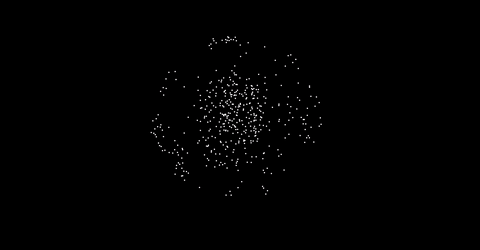

## The supernova

This snippetry is part of *Flanimals*, a [flag- and animal-finding game](http://larsvers.github.io/flanimals/). But for me the supernova has been a little project in its own right. It's the final act of *Flanimals*, so after you've collected your 178 flags and 111 animals - listening to a lot of bings and grunts - you can sit back and watch the world explode. Few things more relaxing out there really...

##### one tiny technical thingy (for what it's worth)

The supernova is built entirely in Javascript and friends with a lof of [D3.js](https://d3js.org/)-lifting. The shreds are SVG-circles connected by a highly erratic force-layout changing its gravity and friction to *Also sprach Zarathustra*. Some of the colour-effects are kindly facilitated by the splendid [HSL-colour-space](https://css-tricks.com/yay-for-hsla/), which is a pure pleasure to work with when your aim is to programmatically change colour:

```JavaScript

d3.selectAll('circle.shreds')
	.transition()
	.duration(dur)
	.delay(function(d,i) { return i / n * dur ; })
	.each('end', function(){
		d3.select(this)
			.style('fill', 'hsl(' + Math.floor(Math.random()*360) + ', 100%, 50%)')
			.attr('r', 3);
	});

```

As this is JavaScript trying to be *After Effects* and in fact reeling off a short film, there are a lot of `setTimeout`'s and `setInterval`'s involved to time the state, the layouts and the twitches to the music. Tweaking necessary but it sort of works. If music and visual is out of sync, you should reload the whole thing for the browser to cache the music...

--



--

For the full *Flanimals* joy [come over here](http://larsvers.github.io/flanimals/)